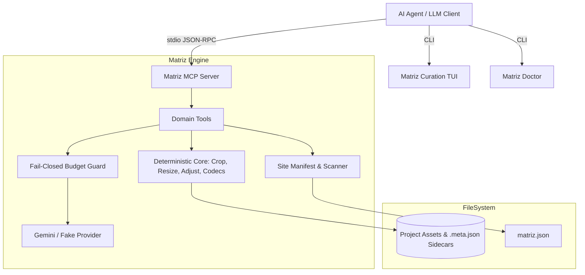

# Matriz (matriz-mcp)

[](https://golang.org)
[](https://modelcontextprotocol.io)
[-brightgreen.svg)]()
[]()

> **Deterministic and Generative Image Pipeline for Autonomous Web Engineering Agents.**

**Matriz** is a local-first Model Context Protocol (MCP) server, interactive Curation TUI, and deterministic image pipeline built in Go. It empowers AI coding agents (Claude Desktop, Cursor, Antigravity, Windsurf) to inspect, transform, generate, and optimize web assets without human intervention, context-window bloat, or uncontrolled cloud spend.

---

## 🏛️ Core Principles



1. **Client Assets are Sacred**: Original client assets (`origin: client`) are immutable. They are never overwritten, mutated in-place, or deleted.
2. **Determinism is Free (0 Cost)**: Any operation that can be solved locally with standard algorithms (crops, resizes, color correction, format conversion) is executed locally in microseconds at zero financial cost.
3. **Generative Operations Cost Money**: Model calls (Gemini) are strictly reserved for generating novel pixels (drafts, inpainting, outpainting, background removal) and are guarded by a fail-closed pre-flight budget guard.
4. **Zero CGo / Pure Go & WASM**: Modern image codecs (WebP, JPEG, PNG) run cleanly without requiring system C libraries or dynamic linking.
5. **No Context Pollution**: High-resolution image bytes never cross the stdio MCP protocol stream. The server generates compact thumbnail previews (max 512px) embedded directly into `ImageContent` responses.
6. **Sidecar Provenance**: Every generated or derived asset is paired with a `.meta.json` sidecar adhering to `matriz.sidecar/v1`.

---

## 🚀 Quick Start

### Installation & Build

```bash
# Clone repository
git clone https://github.com/toscodevjs/matriz.git
cd matriz

# Build unified CLI and tools
go build -o bin/matriz ./cmd/matriz
```

### Run Diagnostics

Validate your Go runtime, codecs, configuration, and MCP integrations:

```bash
./bin/matriz doctor
```

```text
MATRIZ Doctor (v0.2.0) — Diagnostic Report

[✓] Go Runtime & Codecs: go1.26.3 runtime operational; PNG, JPEG, WebP codecs verified
[✓] Configuration & Budget: Active provider "gemini", budget ceiling $2.00
[✓] Google API Key: Key detected (AIza...XXXX)
[✓] Project Structure: Valid matriz.json found (/workspace/matriz.json)
[✓] MCP Client Integration: Claude Desktop (configured)

Status: Everything is healthy and ready to use!
```

---

## 🛠️ CLI Interface (`bin/matriz`)

The unified CLI provides instant access to all capabilities:

| Command | Description | Example |
|---|---|---|
| `matriz doctor` | Health-checks codecs, API keys, project manifest, and MCP setups. | `./bin/matriz doctor` |
| `matriz version` | Displays version and build info (`--json` supported). | `./bin/matriz version -j` |
| `matriz mcp` | Starts the stdio Model Context Protocol (MCP) server. | `./bin/matriz mcp` |
| `matriz tui` | Opens the interactive terminal asset curation browser. | `./bin/matriz tui` |

---

## 🖥️ Interactive Curation TUI & HTML Preview

Matriz includes a lightweight terminal curation UI built with **Bubbletea** & **Lipgloss**:

```text
 MATRIZ Curation TUI — Peluquería Estilo & Arte 

  Assets:
  > assets/hero-01.avif (1920x823, generated, image/avif)
    assets/chair-vintage.png (1080x1080, client, image/png)
    assets/hero-768w.webp (768x329, derived, image/webp)

  ╭──────────────────────────────────────────────╮
  │ Selected: assets/hero-01.avif                │
  │ Dimensions: 1920x823 (21:9)                  │
  │ Origin: generated                            │
  │ Size: 82.24 KB                               │
  ╰──────────────────────────────────────────────╯

Controls: ↑/k up • ↓/j down • enter open preview • q quit
```

Pressing `Enter` on any selected asset opens an instant standalone **HTML Visual Inspector** in your browser (`internal/preview/html.go`), displaying the full-resolution asset alongside its JSON sidecar metadata.

---

## 🔌 MCP Tools & Resources Reference

All MCP tools are grouped under the `img_` prefix:

### Decision Matrix: Deterministic vs Generative

| Task | Recommended Tool | Model Call? | Cost |
|---|---|:---:|:---:|
| Crop / Reframe | `img_transform` | ❌ No | **FREE ($0.00)** |
| Resize / Scale | `img_transform` | ❌ No | **FREE ($0.00)** |
| Brightness / Contrast / Saturation | `img_transform` | ❌ No | **FREE ($0.00)** |
| Rotate / Sharpen | `img_transform` | ❌ No | **FREE ($0.00)** |
| Convert to WebP / JPEG / PNG | `img_transform` | ❌ No | **FREE ($0.00)** |
| Generate new image drafts from prompt | `img_generate_drafts` | ✅ Yes | **Paid (Tokens)** |
| Inpaint / Outpaint / Remove background | `img_refine` | ✅ Yes | **Paid (Tokens)** |
| Elevate draft to high-resolution Pro quality | `img_upscale` | ✅ Yes | **Paid (Tokens)** |
| Generate new video from prompt (Async) | `video_generate` | ✅ Yes (Omni Flash / Veo 3.1) | **Paid ($/s)** |
| Animate existing image asset to video | `video_generate` | ✅ Yes (Omni Flash / Veo 3.1) | **Paid ($/s)** |
| Check status of in-flight video job | `video_status` | ❌ No (Local Engine) | **FREE ($0.00)** |
| Cancel video job & release budget hold | `video_cancel` | ❌ No (Local Engine) | **FREE ($0.00)** |
| Inspect active provider & budget | `img_list_models` | ❌ No | **FREE ($0.00)** |

### MCP Resources

- **Project Manifest (`matriz://project/manifest`)**:
  - Autonomous agents read this resource to understand design slots, required aspect ratios, minimum widths, color palette, and asset inventory before generating assets.
- **Active Video Jobs (`matriz://jobs`)**:
  - Inspects active and completed asynchronous video generation jobs, progress percentage, ETA, and produced video references.

---

## ⚙️ Configuration

Matriz adheres to 12-Factor principles and is configured exclusively via environment variables:

| Environment Variable | Description | Default |
|---|---|---|
| `GOOGLE_API_KEY` | Google AI Studio API Key for Gemini multimodal models. | *(empty)* |
| `MATRIZ_PROVIDER` | Active provider (`gemini` or `fake`). | `gemini` |
| `MATRIZ_BUDGET_USD` | Spending ceiling per session (fail-closed guard). | `2.00` |
| `MATRIZ_MAX_GENERATIVE_CALLS` | Max generative calls allowed per session. | `20` |
| `MATRIZ_PROJECT_ROOT` | Target web project root directory. | `.` |
| `MATRIZ_MODEL_DRAFT` | Model ID for low-res fast image drafts. | `gemini-3.1-flash-lite-image` |
| `MATRIZ_MODEL_FINAL` | Model ID for production image refinement. | `gemini-3-pro-image-preview` |
| `MATRIZ_MODEL_VIDEO_DRAFT` | Model ID for fast video drafts & conversational animation. | `gemini-omni-1.1-flash` |
| `MATRIZ_MODEL_VIDEO_FINAL` | Model ID for cinematic high-fidelity final video. | `veo-3.1-generate-preview` |

### Setting up Claude Desktop

Add Matriz to `~/Library/Application Support/Claude/claude_desktop_config.json`:

```json
{
  "mcpServers": {
    "matriz": {
      "command": "/absolute/path/to/matriz-mcp/bin/matriz",
      "args": ["mcp"],
      "env": {
        "GOOGLE_API_KEY": "AIzaSy...",
        "MATRIZ_PROVIDER": "gemini",
        "MATRIZ_BUDGET_USD": "5.00",
        "MATRIZ_PROJECT_ROOT": "/path/to/your/web/project"
      }
    }
  }
}
```

### Setting up Cursor / Antigravity

Add Matriz to your workspace or global MCP settings (`~/.cursor/mcp.json`):

```json
{
  "mcpServers": {
    "matriz": {
      "command": "/absolute/path/to/matriz-mcp/bin/matriz",
      "args": ["mcp"],
      "env": {
        "GOOGLE_API_KEY": "AIzaSy...",
        "MATRIZ_BUDGET_USD": "5.00"
      }
    }
  }
}
```

---

## 💡 Senior Architect Recommendations

1. **Always Read the Manifest First**: Direct your LLM prompts to inspect `matriz://project/manifest` before generating drafts. This ensures correct aspect ratios (`21:9`, `16:9`) and prevents aspect ratio mismatches.
2. **Favor Deterministic Transformations**: Never use `img_refine` or `img_upscale` for contrast, cropping, or resizing. `img_transform` is instantaneous, 100% deterministic, offline, and free.
3. **Use Drafts Before Final Elevation**: Generate 3–4 draft variations at low resolution (max 768px) with `img_generate_drafts`, review the embedded thumbnail previews, and elevate only the chosen candidate using `img_upscale` (with Gemini Pro).
4. **Pick the Output Format via the Extension**: `img_transform` infers the encoder from the `output` path extension, so writing to `.webp` or `.png` converts the asset in the same free, deterministic pass as the crop or resize.

---

## 🧪 Testing & Verification

Matriz was developed following **Strict TDD** (Red-Green-Refactor) and **Specification-Driven Development (SDD)**:

```bash
# Run complete test suite (19 test suites, zero dependencies needed)
go test -v ./...

# Run static analysis
go vet ./...
```

---

## 📄 License

MIT License — see [LICENSE](LICENSE) for details.
