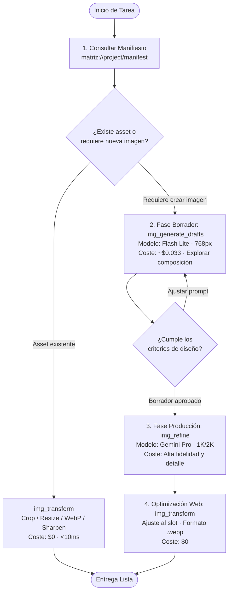

# Flujo de Trabajo Profesional para Agentes (MCP Workflow)

Guía operativa para que agentes de IA (Claude, Cursor, Antigravity, Windsurf) utilicen las herramientas de Matriz de forma eficiente, económica y con máxima calidad visual.

---

## Patrón de Generación y Optimización en 3 Fases

### Fase 1: Exploración y Bocetado Rápido (`img_generate_drafts`)
* **Modelo**: `gemini-3.1-flash-lite-image` (Borrador / Draft).
* **Coste**: $\approx \$0.033\text{ USD}$ por imagen.
* **Propósito**: Validar composición, paleta de colores, iluminación y concepto general.
* **Buenas Prácticas**:
  1. Generar 1 a 4 borradores con `count: 2` o `count: 4` a resolución reducida (`768px`).
  2. Ajustar el `prompt` y `aspect_ratio` (16:9, 1:1, 21:9, 9:16) hasta obtener la composición deseada.
  3. **No gastar llamadas en modelos Pro durante la fase de ideación.**

---

### Fase 2: Elevación a Calidad Pro (`img_refine`)
* **Modelo**: `gemini-3-pro-image-preview` (Producción / Final).
* **Propósito**: Máximo detalle fotográfico, texturas realistas y resolución de producción.
* **Buenas Prácticas**:
  1. Tomar el `ref` del borrador aprobado en la Fase 1 como referencia base.
  2. Aplicar `operation: inpaint`, `outpaint` o `remove_background` para corregir detalles específicos o extender el encuadre.
  3. El sidecar persistirá automáticamente la procedencia (`derived_from`) y el coste real.

---

### Fase 3: Post-Procesamiento Determinista Local (`img_transform`)
* **Coste**: **$0.00 USD e instantáneo (< 15 ms).**
* **Formatos soportados**: `.webp`, `.png`, `.jpg` / `.jpeg`.
* **Propósito**: Adaptar la imagen generada a las dimensiones exactas del maquetado web sin deformar ni degradar calidad.
* **Buenas Prácticas**:
  1. **Nunca pedirle a un LLM generativo que cambie el tamaño o convierta formatos.** Usa siempre `img_transform`.
  2. Ajustar al ancho/alto exacto del slot en la web (`width`, `height`).
  3. Aplicar enfoque sutil (`sharpen: 1.0` a `1.5`) para compensar el escalado.
  4. Guardar siempre en formato moderno **`.webp`** para producción.

---

## Resumen de Reglas Clave para el Agente

| Tarea Requerida | Herramienta Correcta | Coste |
|---|---|:---:|
| Redimensionar, recortar o encuadrar | `img_transform` | **GRATIS ($0)** |
| Convertir a WebP / JPEG / PNG | `img_transform` | **GRATIS ($0)** |
| Ajustar brillo, contraste, nitidez | `img_transform` | **GRATIS ($0)** |
| Crear nueva imagen desde texto | `img_generate_drafts` | **Facturado (Draft)** |
| Editar detalles, inpainting, quitar fondo | `img_refine` | **Facturado (Pro)** |
| Consultar slots y dimensiones del sitio | `matriz://project/manifest` | **GRATIS ($0)** |
