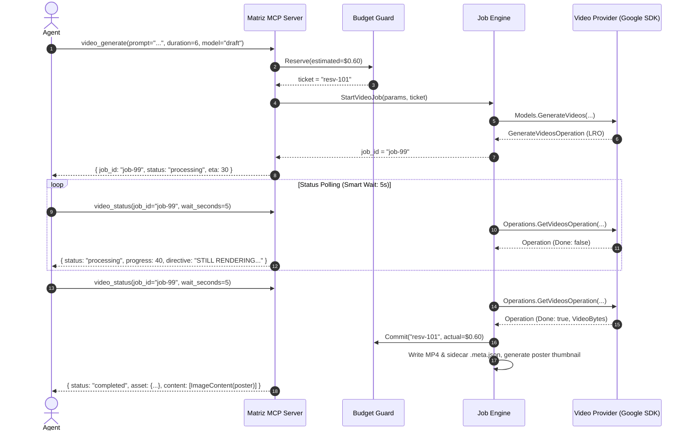

# Architectural Design: Asynchronous Video Generation in Matriz

## Context & Motivation
Video generation with modern diffusion models (Gemini Omni Flash for rapid previews, Veo 3.1 for cinematic production) takes between 15 seconds and 3 minutes. Standard MCP client hosts enforce strict tool request timeouts (30s–60s) and LLM agent inference loops freeze if a tool blocks synchronously. 

Furthermore, video operations carry significantly higher financial costs ($0.50–$3.00+) and failure modes (safety content filtering, generation timeouts). This design introduces an asynchronous job execution model, dedicated provider contracts, and two-phase budget reservation without violating the single-core architecture or the pure Go / zero-CGo mandate.

---

## Architectural Decision Records (ADRs)

### ADR-1: Dedicated `VideoProvider` Interface (Interface Segregation Principle)
* **Decision:** Introduce a distinct `VideoProvider` interface in `internal/providers/video.go` instead of adding video methods to `providers.Provider` or stuffing video bytes into image `Result.Images`.
* **Rationale:** Image providers (like localized upscalers or background removers) should not be forced to implement video stubs. Separation allows `Registry` to discover `VideoProvider` via Go type assertions (`if vp, ok := p.(VideoProvider); ok`).
* **Contract:**
  ```go
  type VideoProvider interface {
      Name() string
      Capabilities() []Capability
      EstimateVideoCostUSD(req VideoRequest) float64
      StartVideo(ctx context.Context, req VideoRequest) (*VideoJob, error)
      PollVideo(ctx context.Context, jobID string) (*VideoJob, *VideoResult, error)
      CancelVideo(ctx context.Context, jobID string) error
  }
  ```

---

### ADR-2: "Call-Now, Fetch-Later" Job Pattern with Server-Side Smart Wait
* **Decision:** Decouple video generation into two tools:
  1. `video_generate`: Dispatches request, returns `<500ms` with `job_id`, `status: "processing"`, and metadata.
  2. `video_status`: Queries status with bounded server-side wait (`wait_seconds`, default 5, max 10s).
* **Rationale:**
  - Standard MCP clients abort calls that exceed 30–60 seconds. Returning a job token immediately ensures zero client timeouts.
  - Server-side smart wait holds the response for up to 5 seconds if the job is still running, naturally throttling the LLM agent turn and eliminating tight-loop polling storms.
  - Non-terminal responses include an actionable `directive` instructing the agent to pause or report progress to the user.

---

### ADR-3: Ticket-Based Two-Phase Budget Reservation
* **Decision:** Evolve `internal/budget/budget.go` `Guard` to manage in-flight holds using tickets:
  - `Reserve(estimateUSD) (ticketID, error)`: Locks estimated funds in `reservedUSD` and increments `inFlight`. Fails closed if `spent + reserved + estimate > limit`.
  - `Commit(ticketID, actualUSD)`: Deducts hold, increments `spentUSD`, increments `calls`, decrements `inFlight`.
  - `Release(ticketID)`: Deducts hold without incrementing `spentUSD` or `calls`.
* **Rationale:** Long-running jobs are prone to safety filter rejections or network cancellations. Committing up-front unfairly burns user budget on failures; unreserved dispatch allows concurrent jobs to breach budget limits.

---

### ADR-4: Sidecar Lineage (`derived_from`) & Poster Preview Delivery
* **Decision:**
  - Video files are written to `assets/videos/` with project-relative paths.
  - Each video has an adjacent `<video>.mp4.meta.json` sidecar conforming to `matriz.sidecar/v1`.
  - For Image-to-Video tasks, `derived_from` explicitly references the input image `AssetRef`.
  - `video_status` returns an `*mcp.ImageContent` poster thumbnail (<= 512px max edge) alongside asset metadata so the agent and user receive immediate visual feedback over stdio without shipping large MP4 binaries.

---

### ADR-5: Pure Go & Zero-CGo Compliance
* **Decision:** Use pure Go atom parsing for basic MP4 metadata and manifest integration. Never introduce CGo bindings to FFmpeg or libavcodec.
* **Rationale:** Preserves instant cross-compilation across macOS (arm64/amd64) and Linux targets as dictated by `openspec/config.yaml`.

---

## State Machine & Sequence Flow

```
                   [video_generate]
                          |
                          v
                    +------------+
                    | PROCESSING | (Budget reserved: ticket resvID)
                    +------------+
                     /    |     \
     [Success]      /     |      \  [Error / Safety Filter / Timeout]
                   /      |       \
                  v       |        v
           +-----------+  |   +----------+
           | COMPLETED |  |   |  FAILED  |
           +-----------+  |   +----------+
           (Commit ticket,|   (Release ticket,
            write MP4 &   |    restore budget)
            sidecar)      |
                          | [video_cancel]
                          v
                    +-----------+
                    | CANCELLED |
                    +-----------+
                    (Release ticket hold)
```



---

## Architecture Boundaries & Single Core
* **Core (`internal/core`, `internal/jobs`, `internal/providers`):** Manages models, asset references, sidecars, and provider dispatch.
* **Frontends:**
  - **MCP Stdio Server (`internal/mcpserver`):** Exposes `video_generate`, `video_status`, `video_cancel`, and `matriz://jobs/{id}`.
  - **TUI (`internal/tui`):** Reads videos and sidecars via manifest scanning to display motion asset status in the interactive terminal.
